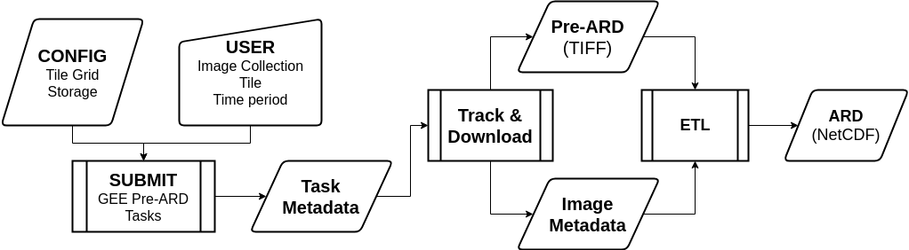

.. _submissions:

==========================
"Pre-ARD" Order Submission
==========================

Overview
========

During the order submission phase, CEDAR takes information from your
configuration file about the tiling grid system you want to use and how you
want to store your data in order to create tiled data for a given image
collection, location (tile), and period of time. 

Using this information, CEDAR uses sensor, or image collection, specific
functions that create "pre-ARD", or data that is fully preprocesed but needs
to be converted into a new format to meet the definition of ARD. This
"pre-ARD" data consists of two sets of information:

1. "Pre-ARD" images

   * GeoTIFF images created by exporting a "pre-ARD" ``ee.Image`` to a storage
     location.
   * Usually consists of multiple pieces to keep each GeoTIFF below 4GB

2. "Pre-ARD" metadata

   * Information about the order, storage, and tile
   * Image information, including

         - Band names
         - No Data Value
         - ARD image metadata for each date of acquisition

         CEDAR
